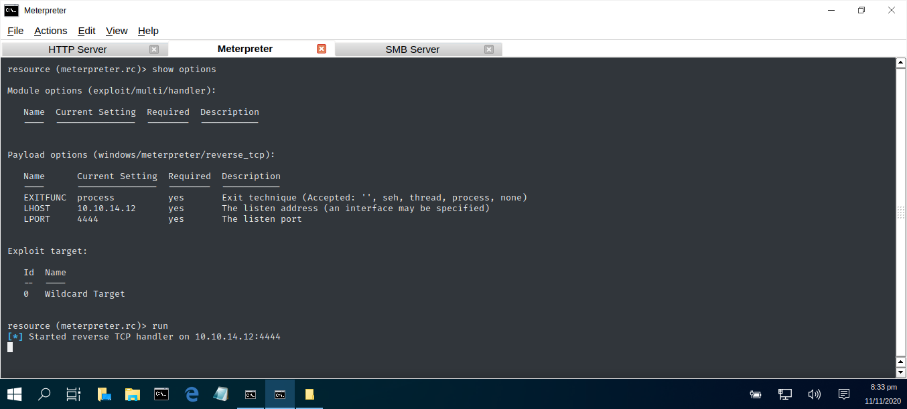

# WIN-HTTP-SERVER

A custom shell-script file that downloads varies exploitation files and manages a simple Windows HTTP Server.

TESTED: Kali Linux 2019  
USAGE : sh windows.sh

| SCRIPT | FILENAME    | INFORMATION                   | MD5 Hash                         | Version |
|------  |------       | -------                       | ----                             | ----   |
| sh     | install.sh  | Installs all necessary files. | 095f44f2649b19c5df41ac20900fbff8 | abc123 |
| sh     | windows.sh  | Manages HTTP server profiles. | 7604fdbe902f9ad5c82a2224d92afd3c | abc123 |
| sh     | tidyup.sh   | Tidy's up redundent files.    | ccf7f62f08b179c9bd273f5f2fa1e909 | abc123 | 

## COMPUTER MISUSE ACT 1990 - SECTION 3A
This software program has been specifically written for the purpose of legitimate penetration testing and should not be used for any other unauthorised or nefarious reasons.

### CONSOLE DISPLAY

